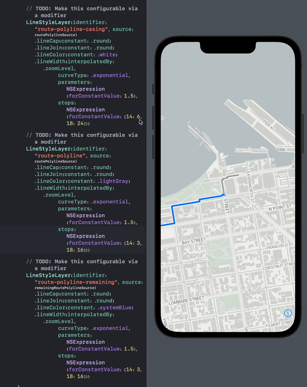

# MapLibreSwiftUI

Swift DSLs for [MapLibre Native](https://github.com/maplibre/maplibre-native), a free open-source renderer
for interactive vector maps, to enable better integration with SwiftUI and generally enable easier use of MapLibre.



This package is a playground (read: not yet stable) to experiment with Swift DSLs and SwiftUI without constraints.
As more people try this out with their own use cases, the community should eventuallly stabilize on a
reasonably optimal DSL for working with MapLibre in Swift. The package name is currently MapLibreSwiftUI, but it's
possible that the SwiftUI and DSL layers are separable.

If successful, some version this project should eventually either get merged into MapLibre Native or at the least
merged into the MapLibre organization more formally. It is being developed as a separate package initially so we
can move fast without breaking anything important.

**NOTE: This currently only works on iOS, as that's the only architecture currently published in the dynamic framework.**

## Goals

1. Primary: Make common use cases easy and make complicated ones possible
    * Easy integration of MapLibre into a modern SwiftUI app
    * Add markers and similar annotations
    * Clustering (common use case that's rather difficult for first timers)
    * Overlays
    * Dynamic styling
    * Camera control / animation??
2. Prevent most common classes of mistakes that users make with the lower level APIs (ex: adding the same source twice)
3. Deeper SwiftUI integration (ex: SwiftUI callout views)

## Quick start

Add the following to the main dependencies section of your `Package.swift`.

```swift
        .package(url: "https://github.com/stadiamaps/maplibre-swiftui-dsl-playground", branch: "main"),
```

Then, for each target add either the DSL (for just the DSL) or both (for the SwiftUI view):

```swift
                .product(name: "MapLibreSwiftDSL", package: "maplibre-swiftui-dsl-playground"),
                .product(name: "MapLibreSwiftUI", package: "maplibre-swiftui-dsl-playground"),
```

Check out the (super basic) [previews at the bottom of MapView.swift](Sources/MapLibreSwiftUI/MapView.swift)
or more detailed [Examples](Sources/MapLibreSwiftUI/Examples) to see how it works in practice.

## Developer Quick Start

This project uses [`swiftformat`](https://github.com/nicklockwood/SwiftFormat) to automatically handle basic swift formatting
as well as to lint and ensure conformance in PRs. Check out the swiftformat [Install Guide](https://github.com/nicklockwood/SwiftFormat?tab=readme-ov-file#how-do-i-install-it)
to add swiftformat to your machine.

Once installed, you can autoformat code using the command:

```sh
swiftformat .
```

Swiftformat can occasionally poorly resolve a formatting issue (e.g. when you've already line-broken a large comment). Issues like this are typically easy to manually correct.

## Structure

This package is structured into a few targets. `InternalUtils` is pretty much what it says. `MapLibreSwiftDSL` and
`MapLibreSwiftUI` are published products, and make up the bulk of the project. Finally, `Examples` is a collection of
SwiftUI previews. 

The DSL provides a more Swift-y layer on top of the lower level MapLibre APIs, and features a number of
result builders which enable more modern expressive APIs.

The SwiftUI layer publishes a SwiftUI view with the end goal of being a universal view that can be adapted to a wide
variety of use cases, much like MapKit's SwiftUI views. 

The `Examples` should serve as a rough indication of development progress. While much of the code in the UI layer
isn't formally tested, this acts as our test, and for all intents and purposes, we're following a practical variant of
TDD as we build out functionality.

## How can you help?

The first thing you can do is try out the library! Check out the detailed [Examples](Sources/MapLibreSwiftUI/Examples)
for inspiration. Putting it "through the paces" is the best way for us to converge on the "right" APIs as a community.
Your use case probably isn't supported today, in which case you can either open an issue or contribute a PR.

The code has a number of TODOs, most of which can be tackled by any intermediate Swift programmer. The important
issues should all be tracked in GitHub. DISCUSS comments (should migrate to GitHub issues/discussions) are deeper
questions. Input welcome.

WARNING: This section is slightly out of date. We are targeting MapLibre 6.0 pre-releases, so the docs are not totally
up to date.

The skeleton is already in place for several of the core concepts, including style layers and sources, but
these are incomplete. You can help by opening a PR that fills these in. For example, if you wanted to fill out the
API for the line style layer, head over to [the docs](https://maplibre.org/maplibre-native/ios/api/Classes/MGLLineStyleLayer.html)
and get to work filling out the remaining properties and modifiers.

Note that some Swift 5.9 improvements like macros will make things a bit easier, so it may make sense to punt on
things like fleshing out the expresison API helpers (which will be highly repetitive) till that lands. When in doubt,
check out the issue tracker, as these sholud be noted there.

TODO: Look at PointFree's Snapshot testing that generates images of SwiftUI views. Also look at inline snapshotting.
https://github.com/pointfreeco/swift-snapshot-testing